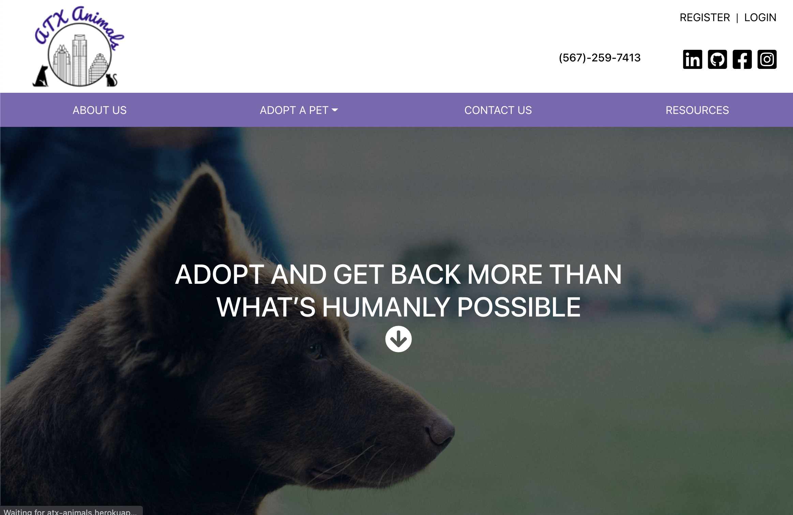
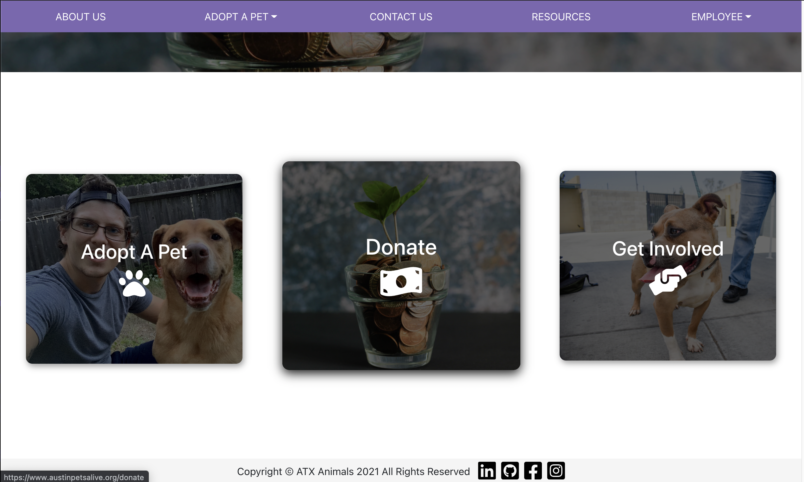
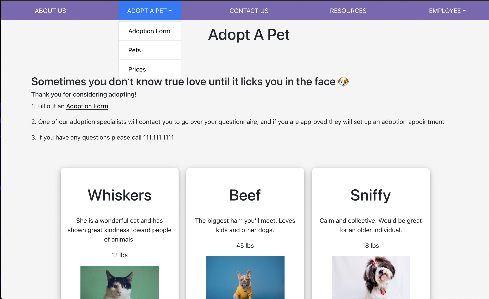
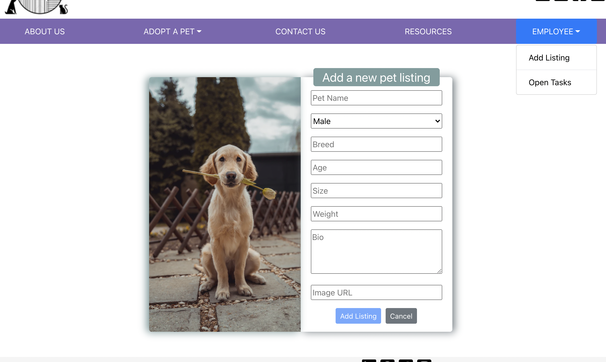
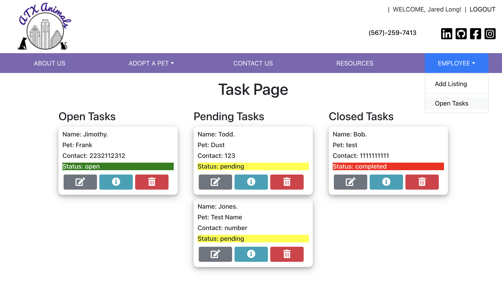

# ATX Animals Client

This is an application that represents a mock animal shelter. There is an adoption form, protected employee routes and functions based on an admin user, as well as a contact form, and adoptable pets!

### Technologies Used:

- React.js
- CSS3
- Bootstrap
- FontAwesome
- Styled Components
- React-Router
- Google Forms
- jsonwebtoken
- Node.js, MongoDB, Express.js API Backend
- sheet.best API
- Reactstrap
- React Modal

### Deployed App:

[Click](https://atx-animals.herokuapp.com/) to see the final app!

#### Admin Test Login:

- Username: jared@jared.com
- password: jared

### Screenshots:

##### Landing Page with logged in employee navbar:

###### \* The employee nav options are only available to logged in employees/admin

##### Navbar without logged in admin

##### HomePage links with hover effect:

##### Adoption Page:

##### Add a new listing:

###### \*This is for employees/admin only.

##### Employee Task Management Page:

###### \*This is for employees/admin only.

### Future Enhancements

- cloudinary to upload images
- have uploaded img show before upload
